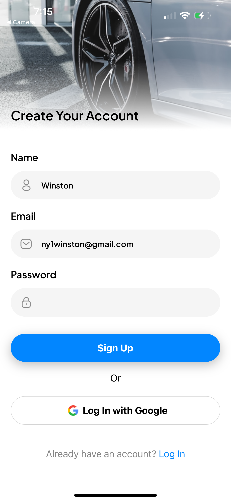

# uberclone app

## Features:
1. Introductory welcome screen. Expo Router for navigation. <br>

2. Account creation page using react native and nativewind. <br>

3. Clerk for two-factor authentication. A verification code is sent to the user's email. <br>

4. A confirmation modal confirming successful authentication. <br>

5. Custom OAuth login is also allowed. <br>

6. Main dashboard page. GEOApify API for map rendering and Google Places API. <br>

7. Google Maps Directions API and GEOApify Static Map API. <br>

8. Select available drivers from database. <br>

9. Book a ride and enter payment details using Stripe. <br>

10. Confirmation modal. <br>

11. Ride history appears here! <br>

12. Postgres db showing nearby drivers. <br>

13. Mock user information, id and password with Clerk.<br>

14. Payment info with Stripe! <br>

uber clone app following JavaScript mastery tutorial. Credits to JavaScript mastery tutorial.(https://www.youtube.com/watch?v=kmy_YNhl0mw)
Figma: https://www.figma.com/design/sYYXxLpiyU7CkvRljZzCRH/Ryde---Uber-Clone-App?node-id=0-1&p=f

postgres database name: jsm_uber

run with a cleared cache:
npx expo start -c

Using: <br>
- React native
- Expo Router for file based navigation 
- Clerk for email authentication
- Zustand for global state management
- Native Wind for styling
- Expo API Routes
- Stripe payments API
- Native fetching with custom hooks
- Advanced reusable components
- Typescript
- ESLint and prettier
- Clerk for authentication with email authorization (https://dashboard.clerk.com/apps/app_2rIL0aFlVSm8ZgYmxIuPVH0wdiw/instances/ins_2rIL0aaumul1VY06riDSRdRHK5a/users)
- Postgres with neon with native SQL queries (https://console.neon.tech/app/projects/lively-lab-80486136/branches/br-white-boat-a5w6hkmc/tables?database=jsm_uber)
- GEOApify Static Map API (https://myprojects.geoapify.com/api/AaXXefybPDeLI7dMvVjb/keys)
- Google Cloud: Places API, Directions API (https://console.cloud.google.com/apis/credentials?inv=1&invt=AbmVVg&project=utopian-catfish-447222-t7)
- Stripe for payment implementation (https://dashboard.stripe.com/test/workbench/overview)

## Notes


# Welcome to your Expo app 👋

This is an [Expo](https://expo.dev) project created with [`create-expo-app`](https://www.npmjs.com/package/create-expo-app).

## Get started

1. Install dependencies

   ```bash
   npm install
   ```

2. Start the app

   ```bash
    npx expo start
   ```

In the output, you'll find options to open the app in a

- [development build](https://docs.expo.dev/develop/development-builds/introduction/)
- [Android emulator](https://docs.expo.dev/workflow/android-studio-emulator/)
- [iOS simulator](https://docs.expo.dev/workflow/ios-simulator/)
- [Expo Go](https://expo.dev/go), a limited sandbox for trying out app development with Expo

You can start developing by editing the files inside the **app** directory. This project uses [file-based routing](https://docs.expo.dev/router/introduction).

## Get a fresh project

When you're ready, run:

```bash
npm run reset-project
```

This command will move the starter code to the **app-example** directory and create a blank **app** directory where you can start developing.

## Learn more

To learn more about developing your project with Expo, look at the following resources:

- [Expo documentation](https://docs.expo.dev/): Learn fundamentals, or go into advanced topics with our [guides](https://docs.expo.dev/guides).
- [Learn Expo tutorial](https://docs.expo.dev/tutorial/introduction/): Follow a step-by-step tutorial where you'll create a project that runs on Android, iOS, and the web.

## Join the community

Join our community of developers creating universal apps.

- [Expo on GitHub](https://github.com/expo/expo): View our open source platform and contribute.
- [Discord community](https://chat.expo.dev): Chat with Expo users and ask questions.
